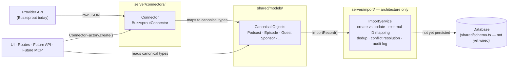

# Podlogix Platform Architecture

Status: **frozen**. This document describes the connector and data-import
architecture as built. No new abstractions, providers, or persistence logic
should be added without an explicit decision to unfreeze a specific layer.

## 1. System overview

Podlogix is a workspace for running a podcast business, not a podcast host.
Hosting is one of several external platforms a show's data can come from —
alongside distribution platforms, sponsorship tools, and (eventually)
listener/analytics platforms. The platform architecture exists to keep that
premise true at the code level: **no external provider's API shape is
allowed to leak past a single, isolated boundary**, and the rest of the
application — UI, routes, future API, future MCP — only ever deals in
Podlogix's own vocabulary.

Three layers make that possible, built in this order:

1. **Connector Framework** (`server/connectors/`) — a provider-agnostic
   contract every external integration implements.
2. **Canonical Object Model** (`shared/models/`) — the business vocabulary
   every part of the application shares, independent of both external
   providers and Podlogix's own database schema.
3. **Import Service** (`server/import/`) — the (currently architecture-only)
   layer responsible for turning canonical objects into database rows.

Today, exactly one connector is implemented end-to-end and read-only:
**Buzzsprout**. Everything else described here is a deliberately-built
skeleton, proven by that one real implementation, ready for more providers
and for persistence to be added without changing the shape of anything
already built.

## 2. Layer responsibilities

| Layer | Lives in | Knows about | Does not know about |
|---|---|---|---|
| Provider API | External (Buzzsprout, Spotify, ...) | Its own data model | Podlogix exists |
| Connector | `server/connectors/` | One provider's API shape, auth, and endpoints | Any other provider; the database; how canonical objects get persisted |
| Canonical Models | `shared/models/` | The business domain (Podcast, Episode, Guest, ...) | Any provider; the database schema; connectors |
| Import Service | `server/import/` | Canonical objects; the *concept* of create/update/conflict/audit | Any provider's API shape; how canonical objects were produced |
| Database | `shared/schema.ts` / Drizzle / Postgres | Its own tables | Canonical objects (today) |
| UI / routes / future API / future MCP | `client/`, `server/routes.ts` | Canonical objects, `ConnectorFactory`, `ImportService` | Any concrete connector class, any provider's field names |

Each layer depends only on the layer(s) below it, never sideways and never
upward. A connector cannot import another connector. Nothing outside
`server/connectors/` imports a concrete connector class — only
`BaseConnector`/`PodcastHostConnector` (types) and `ConnectorFactory`
(instances).

## 3. Data flow



Concretely, for the one real path that exists today:

1. Caller obtains a connector: `ConnectorFactory.create("buzzsprout", { userId, credentials })`.
2. Caller calls `connect()` → `BuzzsproutConnector` validates the API token against Buzzsprout's real API.
3. Caller calls `getPodcasts()` / `getEpisodes(podcastExternalId)` → `BuzzsproutConnector` fetches raw JSON from `buzzsprout.com/api` and maps it, inside the connector, into canonical `Podcast[]` / `Episode[]`.
4. Those canonical objects are the connector's entire output — no Buzzsprout field name exists past this point.
5. (Not yet wired) A caller would pass each canonical object to `ImportService.importRecord()`, which decides create vs. update and would persist it — this step currently stops short of any database write and throws `NOT_IMPLEMENTED` at that boundary.

## 4. Canonical object model

`shared/models/` — pure TypeScript interfaces, no Drizzle, no runtime logic,
importable by both client and server via the existing `@shared/*` alias.
Deliberately **not** derived from `shared/schema.ts` (the Drizzle/Postgres
schema): a provider's API response, and the app's internal vocabulary, both
need to be stable independent of how a table happens to be shaped today.
"The database will eventually map into these objects, not the other way
around."

| Object | Represents |
|---|---|
| `Podcast` | A show. Carries `connections: ConnectorOrigin[]` — one entry per external system it's linked to. |
| `Episode` | One episode, scoped to a `Podcast` via `podcastId` rather than its own workspace ownership. |
| `Guest` | A person booked on episodes — the business side, not a listener. |
| `Sponsor` | A brand/advertiser relationship, with embedded `SponsorDeal[]`. |
| `Campaign` | A promotional effort spanning podcasts/episodes; may reference a `Sponsor`. |
| `Audience` | A rolled-up listener snapshot for a podcast over a period. |
| `Asset` | Any file (artwork, audio, video) — generic, polymorphic `relatedTo`. |
| `Document` | A file with legal/operational weight (contract, release, SOP) — distinct from `Asset`. |
| `Task` | Production/workflow work items. |
| `Automation` | A configured "when X happens, do Y" workflow definition. |
| `Analytics` | A generic, entity-agnostic metric/time-series record (downloads, clicks, revenue, ...) for any other object. |

`shared/models/common.ts` holds the shared shapes: `BaseCanonicalModel`
(id/createdAt/updatedAt), `WorkspaceScoped` (userId), `ConnectorOrigin`
(provider/externalId/lastSyncedAt — a plain string provider, not the
connector framework's own type, so this layer has no build dependency on
`server/connectors`), and `EntityRef` (a polymorphic reference used instead
of embedding).

## 5. Connector framework

`server/connectors/` — a three-level class hierarchy:

```
Connector (interface: provider, capabilities, getStatus, connect, disconnect, sync)
   ▲ implements
BaseConnector<TCapabilities>          — abstract, generic over its capability set
   ▲ extends
PodcastHostConnector                  — abstract, extends BaseConnector<PodcastHostCapabilities>
   │   adds: getPodcasts, getPodcast, getEpisodes, getEpisode,
   │         updateEpisode, publishEpisode, getAnalytics
   │   — every method returns canonical Podcast/Episode directly
   ▲ extends
BuzzsproutConnector                   — the only concrete connector today
```

- **`Connector`/`BaseConnector`** carry only what's true for *every*
  connector, regardless of family: connect/disconnect/status and `sync()`.
  `ConnectorCapabilities` at this level has exactly one flag (`canSync`).
- **`PodcastHostConnector`** is the family-specific layer for providers that
  manage podcasts and episodes. A future connector for a platform that
  *isn't* a podcast host — YouTube, Patreon, Beehiiv — extends
  `BaseConnector` directly and never inherits podcast/episode methods that
  wouldn't make sense for it. `PodcastHostCapabilities` adds `canPublish`,
  `canUpdateEpisodes`, `canFetchAnalytics`.
- **`BuzzsproutConnector`** implements real token-based authentication and
  real reads (`getPodcasts`, `getPodcast`, `getEpisodes`, `getEpisode`)
  against Buzzsprout's actual REST API. `publishEpisode`, `updateEpisode`,
  `getAnalytics`, and `sync` are deliberate `NOT_IMPLEMENTED` stubs — this
  connector is read-only by design for now. All Buzzsprout-specific
  types (raw JSON shapes) and mapping functions are private to
  `BuzzsproutConnector.ts` and exported nowhere.
- **`ConnectorFactory`** is the only place that maps a provider name to a
  concrete class. It returns `BaseConnector`, never a concrete type. Adding
  a provider is one new file plus one registry line — nothing else changes.

## 6. Import pipeline

`server/import/` — the layer between canonical objects and the database.
**Architecture only**: no database access, no persistence, nothing wired to
`storage.ts`.

- **`CanonicalRecord`** is a discriminated union over all eleven canonical
  models, tagged by `entityType`. Only `podcast`/`episode` are actually
  produced by a connector today; the union covers all eleven so the shape
  doesn't have to change as more producers (other connectors, manual entry,
  CSV import) come online.
- **`ImportService.importRecord()`** is real orchestration, not a stub: it
  calls `resolveExternalId()` then `detectDuplicate()` and genuinely decides
  `created` vs. `updated`, respects a `dryRun` option, and only stops short
  at the actual write.
- **`resolveExternalId()`** and **`detectDuplicate()`** return an honest
  `null` rather than throwing — with nothing persisted, "no match found" is
  the *true* answer today, not a placeholder.
- **`reconcile()`**, **`resolveConflict()`**, and **`logAudit()`** throw
  `NOT_IMPLEMENTED`. Each needs a real "other side" that doesn't exist yet
  (a persisted record to reconcile against, two real records in conflict,
  somewhere to write an audit entry) — a trivial stub would misrepresent
  that as done.

This is the layer that will eventually own: create vs. update, external ID
mapping, duplicate detection, sync reconciliation, conflict resolution, and
audit logging — each already has a typed home (`ExternalIdMapping`,
`ImportRecordResult`, `ConflictResolution`, `AuditLogEntry`) even though the
logic behind most of them doesn't exist yet.

## 7. Design principles

- **Provider isolation.** No provider-specific field name, endpoint, or auth
  quirk exists outside that provider's own connector file. Verified for
  Buzzsprout: its raw JSON interfaces and mapping functions are private,
  unexported, module-scoped.
- **Canonical objects are the contract, not the database.** `shared/models/`
  was designed independent of `shared/schema.ts` on purpose. Connectors and
  UI code target the canonical shape; the database is expected to catch up
  to it, not the reverse.
- **Stubs are honest about what they are.** Two distinct stub conventions
  are used throughout, deliberately: a method that can return a truthful
  trivial answer today does so (`resolveExternalId` → `null`); a method that
  cannot throws `NOT_IMPLEMENTED` rather than faking a result (`logAudit`,
  `publishEpisode`). A reader should never have to guess which category a
  given method falls into — it's stated in a comment at each site.
- **Composition over premature genericity.** `ConnectorCapabilities` only
  grew a family-specific extension (`PodcastHostCapabilities`) once a second
  connector family (non-hosts) was explicitly anticipated — not before.
- **Freeze means freeze.** Each layer was built, explicitly approved, and
  locked before the next layer was built on top of it. The one exception —
  updating `PodcastHostConnector`'s method signatures to return canonical
  objects directly instead of the connector framework's now-superseded
  `ConnectorPodcast`/`ConnectorEpisode` DTOs — was called out explicitly at
  the time rather than made silently.

## 8. Future provider integrations

Adding Spotify, Libsyn, Transistor, Apple Podcasts, YouTube, RSS, Patreon,
or Beehiiv is scoped to `server/connectors/` only:

1. Decide the family: does this provider manage podcasts/episodes? Extend
   `PodcastHostConnector`. Otherwise, extend `BaseConnector` directly and
   define that family's own capability interface if one doesn't fit
   `PodcastHostCapabilities`.
2. Implement `authenticate()` for that provider's real auth mechanism (OAuth,
   API token, or otherwise — `ConnectorCredentials` is intentionally opaque
   at the interface level so this isn't constrained to one auth style).
3. Implement the family's abstract methods, mapping that provider's raw API
   responses into canonical objects inside that one file.
4. Register the class with `ConnectorFactory`.

Nothing in `shared/models/`, `server/import/`, routes, or the UI needs to
change. This is the concrete test the whole framework was built to pass.

## 9. Future MCP layer

The canonical object model exists specifically so a future MCP (or any other
machine-facing API) server has a stable, provider-independent vocabulary to
expose — the same `Podcast`/`Episode`/`Guest`/... shapes already used by the
UI and the connectors, not a third representation. An MCP tool like
"list podcasts" or "get episode" would call through `ImportService`-persisted
data (once that layer is implemented) or, for live/uncached reads, through a
`ConnectorFactory`-obtained connector directly — either path returns the
same canonical types. No MCP-specific mapping layer should be necessary;
if one seems needed, that's a signal the canonical model is missing
something, not that MCP needs its own shortcut past it.

## Run

```
tsc --noEmit
npm run build
```
